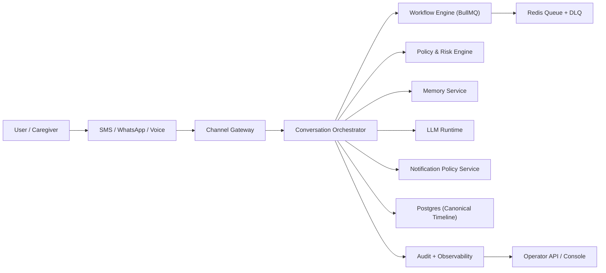
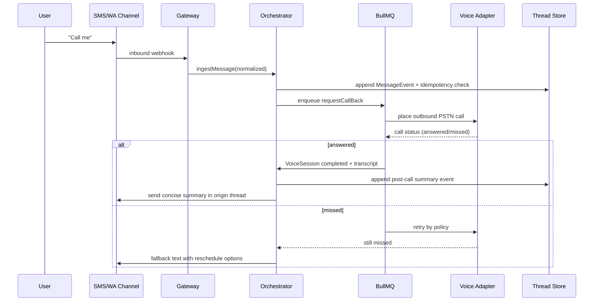
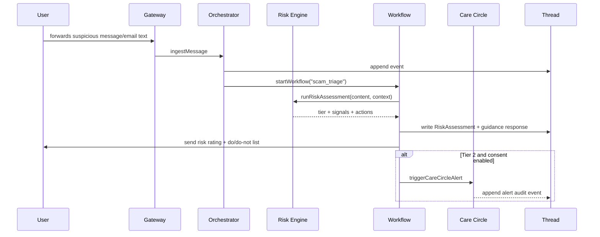
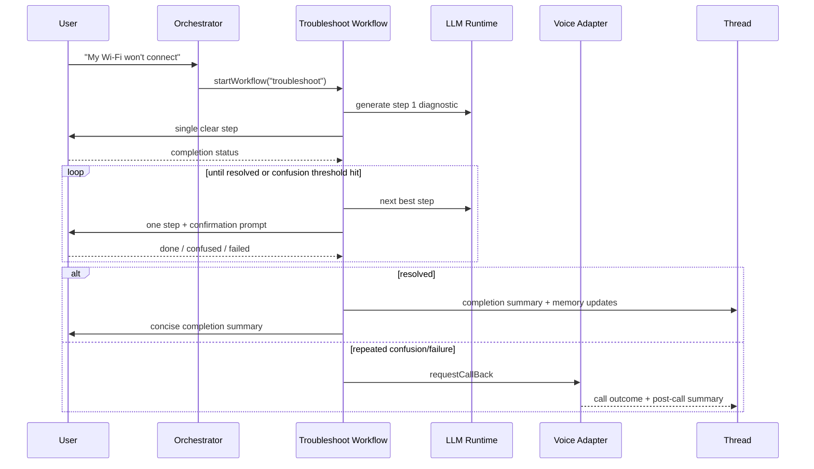

# North Haven by OpenClaw

North Haven is a family-safe, voice-first, messaging-native AI concierge for older adults and their families.

Core product principle:
- Do not force users into a new app.

Primary user interfaces:
- SMS
- WhatsApp
- Voice callback (PSTN)

North Haven is designed to feel like a trusted contact in a phone, not a dashboard SaaS.

## Current Status

This repository is an MVP foundation scaffold with:
- Product and architecture documentation.
- Internal API contracts and OpenAPI spec.
- SQL migrations and schema snapshot validation.
- Starter workflow/policy/channel modules.
- Starter automated tests.
- CI checks for quality, migration smoke tests, and schema diff checks.
- Secondary ChatGPT companion MCP surface for internal operator/caregiver workflows.

## Product Focus (MVP)

In scope:
- Unified channel timeline across SMS, WhatsApp, and voice callback events.
- Tech troubleshooting workflows.
- Scam triage with Tier 0/1/2 risk classification.
- Voice escalation from explicit request ("call me") or repeated confusion.
- Care Circle alerts for Tier 2 risk when explicit consent is present.
- Post-call continuity summary in the originating thread.

Out of scope:
- Native iMessage integration.
- Direct RCS integration.
- Medical diagnosis.
- Financial execution/actions.

## Architecture at a Glance

Main components:
1. Channel Gateway
2. Conversation Orchestrator
3. Policy and Risk Engine
4. Memory Service
5. Workflow Engine (BullMQ + Redis)
6. LLM Runtime
7. Audit and Observability
8. Operator API and Console backend
9. ChatGPT Companion MCP surface (secondary)

High-level diagram and sequence flows:
- [docs/architecture/system-architecture.md](docs/architecture/system-architecture.md)
- [docs/architecture/diagrams.md](docs/architecture/diagrams.md)

## Architecture Diagrams (Inline)

Source-of-truth diagrams are maintained in `docs/architecture/diagrams.md`. The blocks below mirror that source for quick root-level visibility.

### High-Level Architecture



### Sequence: "Call me"



### Sequence: Scam Triage



### Sequence: Troubleshooting with Escalation



## Repository Structure

```text
apps/
  api/                 # Internal API scaffold + OpenAPI + API tests
  worker/              # Async workflow worker scaffold
  operator-console/    # Operator visibility surface scaffold
  chatgpt-mcp/         # Secondary ChatGPT Apps SDK-compatible MCP adapter
packages/
  contracts/           # Typed API envelopes and request/response contracts
  policy-engine/       # Risk tiering and policy guard logic
  workflow-engine/     # Workflow routing and escalation rules
  llm-runtime/         # Prompt and redaction helpers
  channel-adapters/    # Channel payload normalization
infra/
  docker-compose.yml   # Local Postgres + Redis
  db/
    migrations/        # Ordered SQL migration files
    schema.snapshot.sql# Committed canonical schema snapshot
docs/
  discovery/           # Idea brief
  product/             # PRD, JTBD, use-cases
  architecture/        # System architecture and sequence diagrams
  data/                # Data model and sample rows
  api/                 # Internal API contract documentation
  policy/              # Guardrail and risk policy
  conversation/        # User-facing copy templates and tone rules
  engineering/         # Test strategy
  plans/               # Milestone implementation plans
  operations/          # Local/staging runbook
  apps/                # Companion app surface docs
scripts/
  db/                  # Migration apply, smoke test, schema snapshot and diff checks
```

## Prerequisites

- Node.js 20+
- Docker Desktop (for local Postgres/Redis and DB checks)
- Optional: PostgreSQL client (`psql`, `pg_dump`) for direct local DB tooling

## Quick Start

1. Start infra services:

```bash
docker compose -f infra/docker-compose.yml up -d
```

2. Run API scaffold:

```bash
npm run dev
```

3. Run ChatGPT companion surface (secondary):

```bash
npm run dev:chatgpt-mcp
```

4. Run project checks:

```bash
npm run lint
npm run test
npm run build
```

## Database Migration Workflow

### Apply migrations locally

```bash
bash scripts/db/apply_migrations.sh
```

The script will:
- Reset the `public` schema.
- Apply all migrations from `infra/db/migrations` in lexical order.

### Migration smoke tests

```bash
npm run db:migrate:smoke
```

Smoke tests assert:
- Required tables exist.
- Required indexes exist.
- Required triggers/functions exist.

### Generate schema snapshot

```bash
npm run db:schema:snapshot
```

This writes the canonical schema file:
- `infra/db/schema.snapshot.sql`

### Check schema drift

```bash
npm run db:schema:check
```

This regenerates schema from migrations and fails if it differs from committed snapshot.

## CI

GitHub Actions workflow:
- `.github/workflows/ci.yml`

Jobs:
1. **Lint, Test, Build**
   - `npm run lint`
   - `npm run test`
   - `npm run build`

2. **Migration Smoke and Schema Diff**
   - Starts Postgres service.
   - Runs `scripts/db/migration_smoke_test.sh`.
   - Runs `scripts/db/check_schema_diff.sh`.

If you change migrations, update the snapshot in the same PR:

```bash
npm run db:schema:snapshot
```

## API Contracts

- Human-readable API contract: [docs/api/internal-api.md](docs/api/internal-api.md)
- OpenAPI source: [apps/api/openapi/north-haven-internal.yaml](apps/api/openapi/north-haven-internal.yaml)
- Typed contracts: [packages/contracts/src](packages/contracts/src)

Standard envelope:
- Success: `{ ok: true, data, requestId, schemaVersion }`
- Error: `{ ok: false, error: { code, message, retryable, details }, requestId, schemaVersion }`

## ChatGPT Companion Surface

- Companion architecture and usage: [docs/apps/chatgpt-companion-surface.md](docs/apps/chatgpt-companion-surface.md)
- MCP package: `apps/chatgpt-mcp`
- Current scope: read tools + constrained writes (`request_callback`, `append_escalation_note`)
- Auth mode: no-auth in dev, OAuth-ready write-gating shape for staging/prod

## Risk and Safety Policy

See:
- [docs/policy/risk-guardrails.md](docs/policy/risk-guardrails.md)

Key enforcement rules:
- Tier 2 requires reconfirmation + friction checkpoint.
- Care Circle alerts require explicit consent.
- Memory writes are blocked during "Don't save this".
- AI identity disclosure is mandatory in all user-facing interactions.

## Key Documents

- PRD: [docs/product/prd.md](docs/product/prd.md)
- JTBD: [docs/product/jtbd.md](docs/product/jtbd.md)
- Use-cases: [docs/product/use-cases.md](docs/product/use-cases.md)
- Data model: [docs/data/data-model.md](docs/data/data-model.md)
- Test strategy: [docs/engineering/test-strategy.md](docs/engineering/test-strategy.md)
- Runbook: [docs/operations/runbook-local-staging.md](docs/operations/runbook-local-staging.md)
- Milestone plan: [docs/plans/2026-03-01-north-haven-mvp.md](docs/plans/2026-03-01-north-haven-mvp.md)

## Contributing Workflow (Current)

1. Update docs/contracts/migrations together.
2. Run local checks:

```bash
npm run ci
```

3. Ensure migration changes include updated `infra/db/schema.snapshot.sql`.
4. Keep user-facing copy aligned with calm tone and readability constraints.

## Operational Targets (v1)

- Message ingress p95 < 2s.
- Callback initiation p95 < 45s (staging target).
- Completion summary delivery success > 99%.
- Duplicate side effects from webhook retries = 0.

## License

No license file is currently included. Add one before external distribution.
