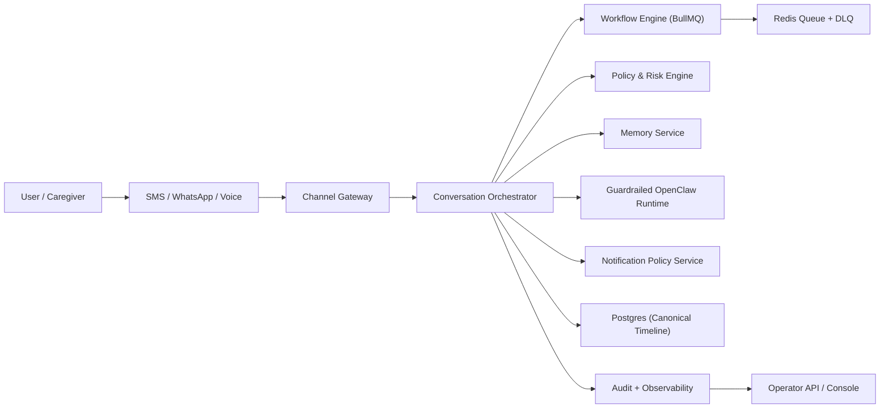
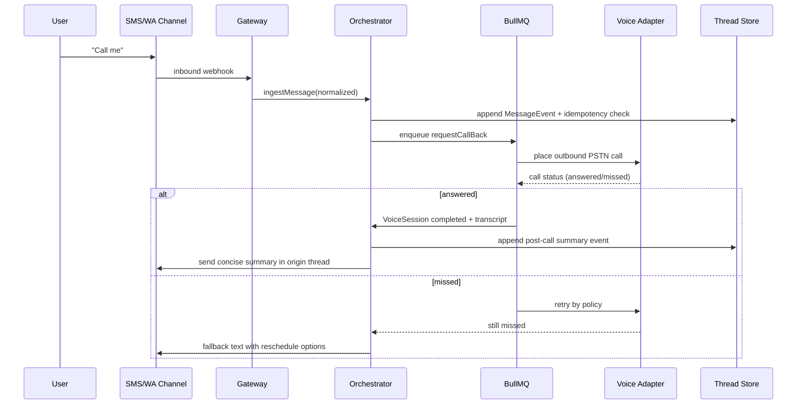
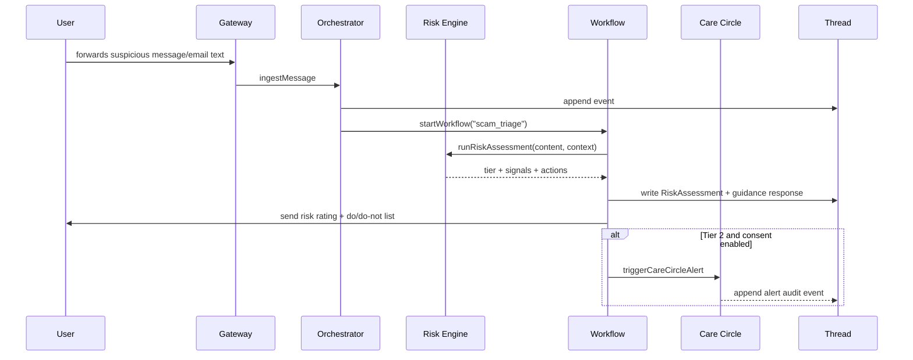
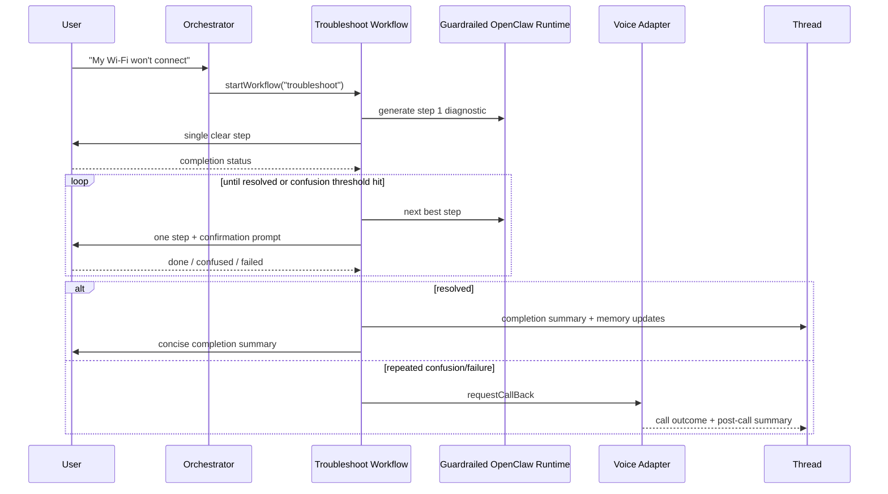

# North Haven Architecture Diagrams

## High-Level Architecture

```mermaid
flowchart LR
U["User / Caregiver"] --> CH["SMS / WhatsApp / Voice"]
CH --> GW["Channel Gateway"]
GW --> ORCH["Conversation Orchestrator"]
ORCH --> WF["Workflow Engine (BullMQ)"]
WF --> RQ["Redis Queue + DLQ"]
ORCH --> RISK["Policy & Risk Engine"]
ORCH --> MEM["Memory Service"]
ORCH --> LLM["Guardrailed OpenClaw Runtime"]
ORCH --> NOTIF["Notification Policy Service"]
ORCH --> DB["Postgres (Canonical Timeline)"]
ORCH --> AUD["Audit + Observability"]
AUD --> OPS["Operator API / Console"]
```

## Sequence: "Call me"

```mermaid
sequenceDiagram
participant User
participant SMS as SMS/WA Channel
participant GW as Gateway
participant OR as Orchestrator
participant Q as BullMQ
participant VO as Voice Adapter
participant TH as Thread Store

User->>SMS: "Call me"
SMS->>GW: inbound webhook
GW->>OR: ingestMessage(normalized)
OR->>TH: append MessageEvent + idempotency check
OR->>Q: enqueue requestCallBack
Q->>VO: place outbound PSTN call
VO-->>Q: call status (answered/missed)
alt answered
Q->>OR: VoiceSession completed + transcript
OR->>TH: append post-call summary event
OR->>SMS: send concise summary in origin thread
else missed
Q->>VO: retry by policy
VO-->>OR: still missed
OR->>SMS: fallback text with reschedule options
end
```

## Sequence: Scam Triage

```mermaid
sequenceDiagram
participant User
participant GW as Gateway
participant OR as Orchestrator
participant RE as Risk Engine
participant WF as Workflow
participant CC as Care Circle
participant TH as Thread

User->>GW: forwards suspicious message/email text
GW->>OR: ingestMessage
OR->>TH: append event
OR->>WF: startWorkflow("scam_triage")
WF->>RE: runRiskAssessment(content, context)
RE-->>WF: tier + signals + actions
WF->>TH: write RiskAssessment + guidance response
WF->>User: send risk rating + do/do-not list
alt Tier 2 and consent enabled
WF->>CC: triggerCareCircleAlert
CC-->>TH: append alert audit event
end
```

## Sequence: Troubleshooting with Escalation

```mermaid
sequenceDiagram
participant User
participant OR as Orchestrator
participant WF as Troubleshoot Workflow
participant LLM as Guardrailed OpenClaw Runtime
participant VO as Voice Adapter
participant TH as Thread

User->>OR: "My Wi-Fi won't connect"
OR->>WF: startWorkflow("troubleshoot")
WF->>LLM: generate step 1 diagnostic
WF->>User: single clear step
User-->>WF: completion status
loop until resolved or confusion threshold hit
WF->>LLM: next best step
WF->>User: one step + confirmation prompt
User-->>WF: done / confused / failed
end
alt resolved
WF->>TH: completion summary + memory updates
WF->>User: concise completion summary
else repeated confusion/failure
WF->>VO: requestCallBack
VO-->>TH: call outcome + post-call summary
end
```
